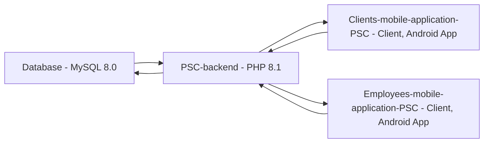

Works only with [PSC-backend](https://github.com/ReevesKKO/PSC-backend).

Also check out [Employees-mobile-application-PSC](https://github.com/ReevesKKO/Employees-mobile-application-PSC).

## How it is supposed to work:

